# Quest-Net

Quest-Net is a real-time collaborative tabletop RPG manager for DMs and players. It brings campaign prep, live play, peer-to-peer sessions, 3D voxel maps, character sheets, combat tools, dice, images, scenes, audio, and world rules into one browser app.

At the table, the DM view keeps the 3D terrain, active actors, environment controls, calendar, rests, and stat cards visible in one workspace.

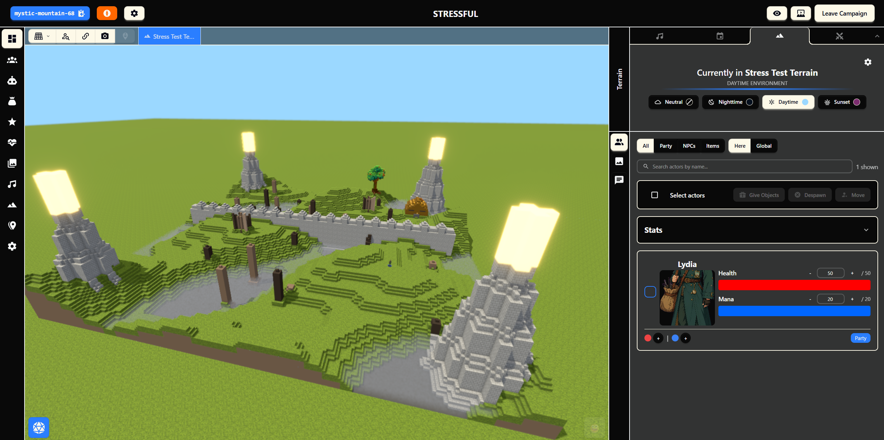

## Start A Campaign

Quest-Net opens with a focused launch screen for local prep, wiki access, settings, and campaign entry.

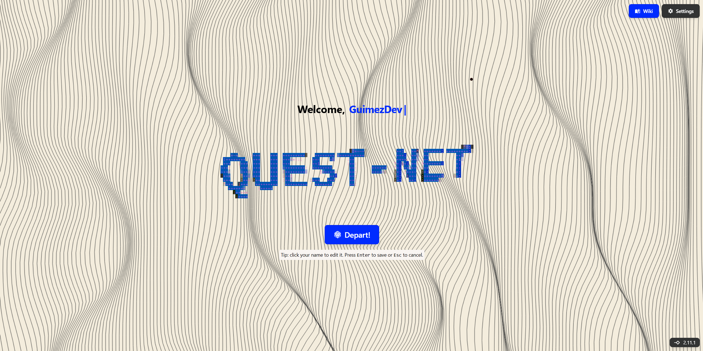

Campaigns can be created locally, imported from JSON, resumed from the campaign list, or joined by room code as a player.

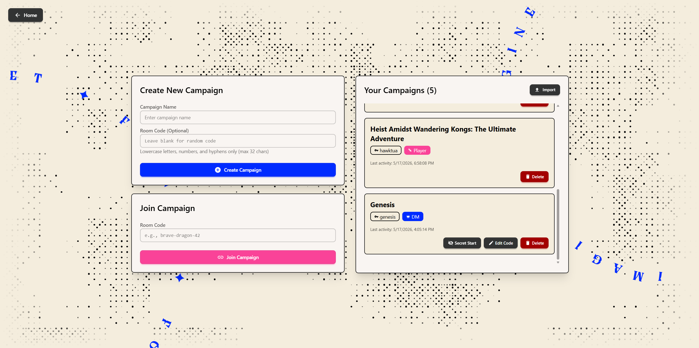

## Run The Table

Movement range is visualized directly on the terrain, so the DM and players can reason about reachable spaces in context.

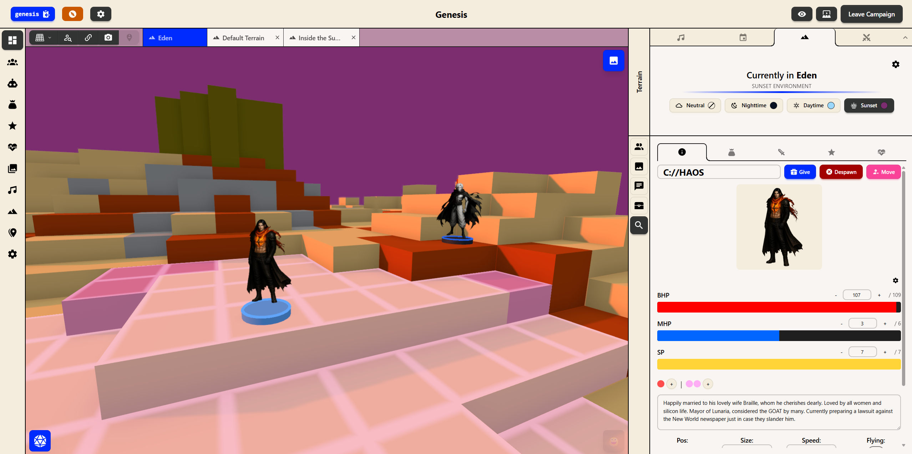

Scene art can be displayed over the map during play while the active actor list and campaign clock stay available.

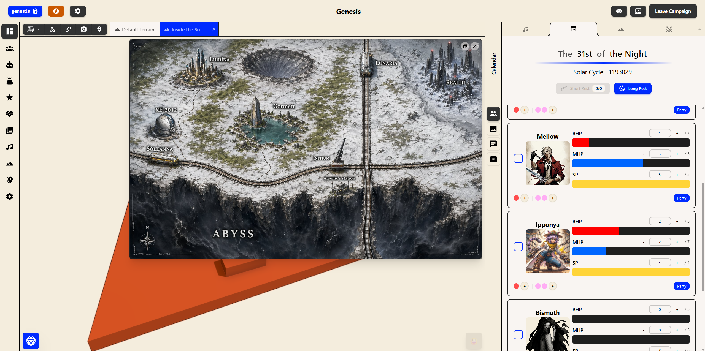

The map can also switch into first-person mode from a character's point of view for exploration, positioning, and table-facing reveals.

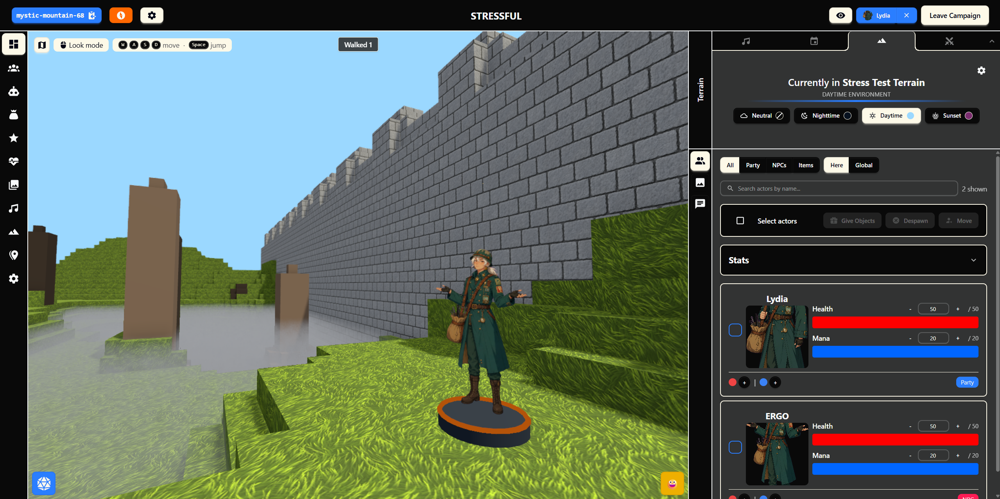

The dice roller supports TTRPG formulas and quick dice buttons, with the panel floating over the active session.

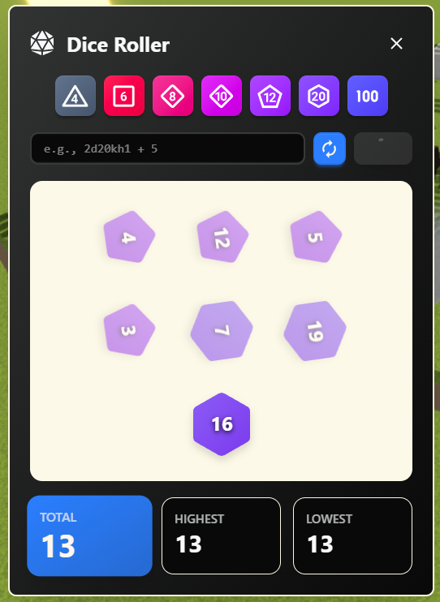

## Build The World

The terrain editor supports high-resolution voxel maps, `.vox` imports, tile and voxel brush modes, actor overlays, material palettes, lighting presets, and preview tools.

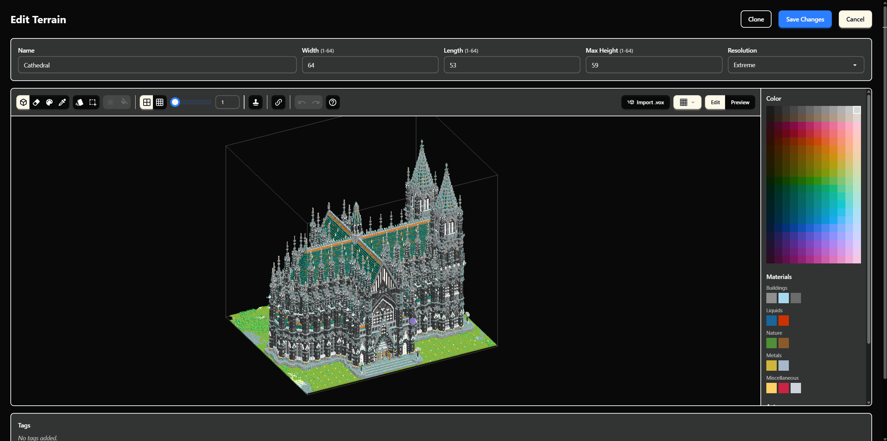

Campaign settings let the DM define stat pools, action economy, attributes, combat rules, rest rules, visibility, terrain presets, shared inventories, and world-rule scripts.

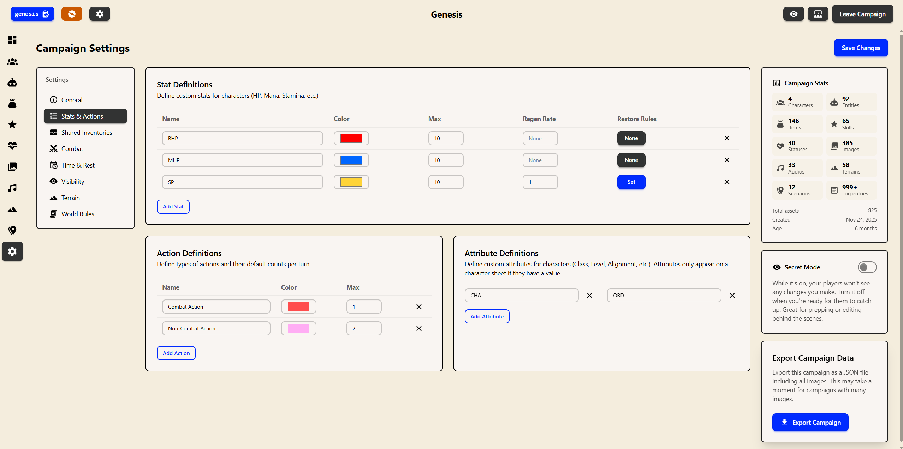

## Manage The Campaign

Item templates can include art, descriptions, tags, folders, scripted behavior, and spawn controls for dropping objects into the live scene.

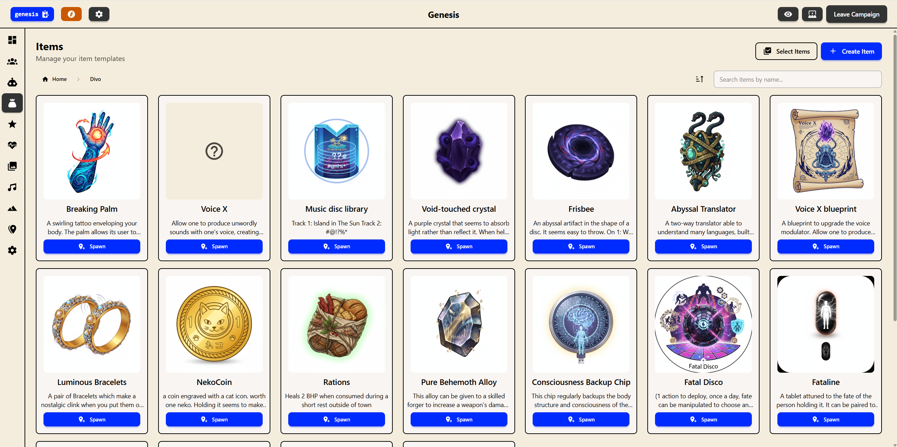

Entity templates use the same campaign database patterns, making NPCs, enemies, hazards, and reusable encounter pieces easy to browse and spawn.

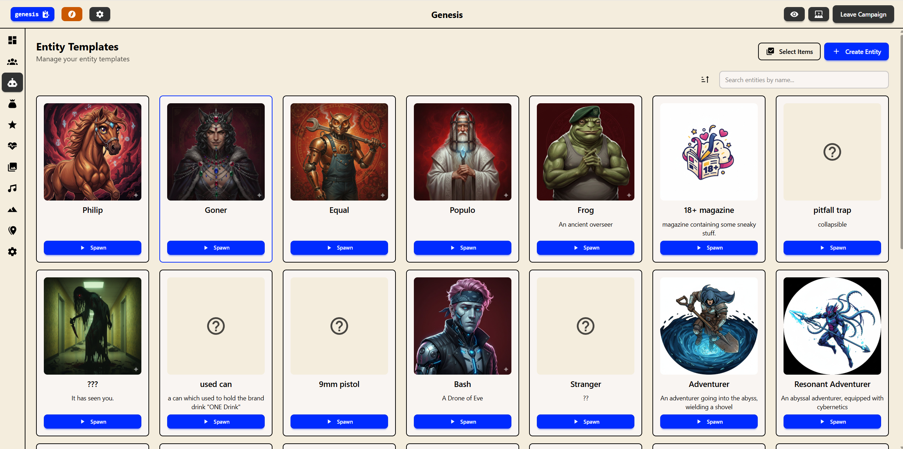

Images live in a campaign image library and can be reused for characters, entities, scenes, focus art, maps, and item cards.

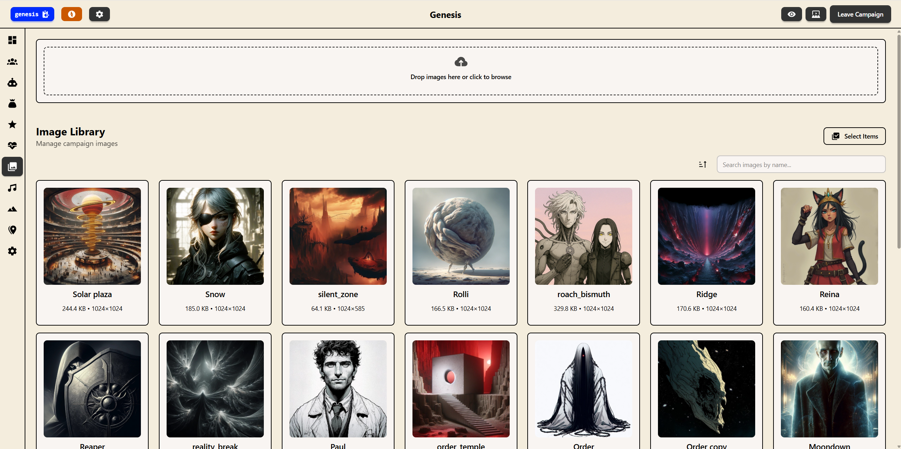

## Tech Stack

- **App framework:** [React](https://github.com/facebook/react), [TypeScript](https://github.com/microsoft/TypeScript), [React Router](https://github.com/remix-run/react-router), and [Vite](https://github.com/vitejs/vite)
- **UI and styling:** [Tailwind CSS](https://github.com/tailwindlabs/tailwindcss), [DaisyUI](https://github.com/saadeghi/daisyui), and [Iconify](https://github.com/iconify/iconify)
- **3D map:** [Three.js](https://github.com/mrdoob/three.js) and [postprocessing](https://github.com/pmndrs/postprocessing)
- **Animation and panels:** [GSAP](https://github.com/greensock/GSAP), [Motion](https://github.com/motiondivision/motion), and [react-rnd](https://github.com/bokuweb/react-rnd)
- **State and data utilities:** [Valtio](https://github.com/pmndrs/valtio), [colorjs.io](https://github.com/color-js/color.js), [fast-json-patch](https://github.com/Starcounter-Jack/JSON-Patch), and [mathjs](https://github.com/josdejong/mathjs)
- **Multiplayer:** [Trystero](https://github.com/dmotz/trystero) for peer-to-peer rooms and WebRTC signaling
- **Storage:** localStorage for compact app state, plus IndexedDB and OPFS-backed payload storage for images and large voxel terrains

## Quick Start

```bash
npm install
npm run dev
```

The dev server runs at `http://localhost:3000/`.

## Useful Scripts

```bash
npm run dev       # Start the local Vite dev server
npm run build     # Type-check and build for production
npm run preview   # Preview the production build locally
```

## Project Layout

```text
src/
  components/     Reusable UI, map, dice, form, and input components
  domains/        Campaign, character, entity, terrain, combat, item, audio, and other feature domains
  services/       Action dispatch, sync, storage, image, terrain, audio, and scripting services
  hooks/          Peer tracking, reconnect, relay watchdog, and UI hooks
  utils/          Dice, terrain, storage, migration, folder, math, and parsing utilities
  migrations/     Versioned context and campaign migrations
  wiki/           In-app documentation pages
```

## Documentation

Quest-Net includes an in-app wiki covering campaign setup, networking, combat, terrains, scripting, data structures, and DM/player workflows. Development-specific notes live in `src/DEVELOPMENT_NOTES.md`.
